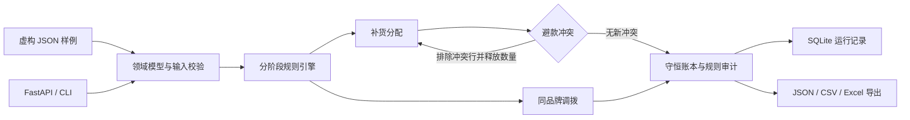

# iRestock | 智能补货与门店调拨工程案例

**规则引擎 / 有限库存分配 / 冲突重新分配 / 调拨守恒 / 可追溯审计**

这是一个零售库存运营项目的公开工程案例。仓库包含可运行的 Python 计算工程、FastAPI 接口、SQLite 运行记录、Excel 导出、虚构样例和回归测试，便于直接阅读代码并复现计算过程。

> 公开工程以生产项目的分层思路为基础，重新实现了通用规则和代表性算法。它不是 V2.2.4 客户交付源码的完整脱敏副本；所有示例数据都是虚构的。公开工程版本为 `0.1.0`，生产项目版本为 `2.2.4`。

## 为什么这个问题有工程难度

补货并非简单地用目标库存减现有库存。库存有限时，多个门店竞争同一份货源；一些门店之间还存在款式互斥。分配后发现冲突，释放出来的数量需要重新进入分配。调拨则还要同时保证调出店保留合理库存、调入需求不被重复满足，并限制跨门店品牌的移动。

结果必须解释到具体规则和中间数量，才能被业务人员复核。

## 从这些代码开始看

| 工程问题 | 公开实现 | 值得关注的逻辑 |
| --- | --- | --- |
| 规则和字段边界 | [domain.py](src/irestock_demo/domain.py)、[rules.py](src/irestock_demo/rules.py) | 不可变输入、重复记录检查、规则协议、阶段顺序、阻断后的短路 |
| 有限货源如何分配 | [allocation.py](src/irestock_demo/allocation.py) | 主推优先、有销保底、销量排序、商品级预留与守恒账本 |
| 避款后如何补位 | [allocation.py](src/irestock_demo/allocation.py) | 同款跨 SKU 冲突、单调增长的排除集合、重新分配、收敛上界 |
| 调拨是否会超调 | [transfer.py](src/irestock_demo/transfer.py) | 商品与品牌索引、调出余量预算、调入剩余需求、移动前后库存守恒 |
| 如何追溯一次计算 | [storage.py](src/irestock_demo/storage.py) | 输入指纹、运行 ID、规则证据索引、单事务保存结果和审计 |
| 导出为什么容易误解 | [exporter.py](src/irestock_demo/exporter.py) | 未计算与真实零值分开、预留量范围明确、公式文本转义 |
| 怎样接成服务 | [web.py](src/irestock_demo/web.py) | 参数校验、422/404 边界、计算与存储分离、运行结果读取 |
| 怎么证明逻辑成立 | [tests/](tests/) | 重新分配场景、随机守恒验证、输入顺序不变性、事务回滚与 API 测试 |



## 运行样例

需要 Python 3.11 或更新版本。纯计算核心只有标准库依赖。

```bash
python -m venv .venv
# Windows: .venv\Scripts\activate
# macOS/Linux: source .venv/bin/activate
python -m pip install -e ".[dev,web,excel]"
python -m irestock_demo --input examples/replenishment.json --output outputs/replenishment --excel
python -m irestock_demo --input examples/transfer.json --mode transfer --output outputs/transfer --excel
python -m pytest -q
```

补货样例刻意包含主推优先、同款互斥、库存重新分配、在单阻断和不可配门店。调拨样例包含同品牌库存竞争、跨品牌阻断和在途阻断。详细输入与预期行为见 [公开工程说明](docs/public-demo.md)。

启动本机 API：

```bash
irestock-demo-web
```

打开 `http://127.0.0.1:8001/docs`，将样例 JSON 提交到 `POST /api/run/replenishment` 或 `POST /api/run/transfer`；再通过 `GET /api/runs/{run_id}` 查看结果和证据。此 API 是本机演示服务，没有生产级认证。

## 验证与工程边界

- 公开工程在本地通过 **35 项测试**；随机测试另外遍历 150 组补货和 100 组调拨数据，检查守恒、约束与确定性。
- [GitHub Actions](.github/workflows/tests.yml) 配置了 Windows/Linux 与 Python 3.11/3.13 测试矩阵。远端运行状态以 Actions 页面为准。
- 避款分配使用确定性的贪心策略，保证约束和终止，不声称是全局收益最优解。
- 演示调拨不支持避款组合；遇到该配置会明确报错，避免静默忽略。

## 原项目交付能力

生产项目另外包含完整业务页面、规则中心、Excel 源表导入、历史结果查询和 Windows 桌面启动器。桌面交付处理了系统托盘、可用端口选择、重复启动保护和用户数据升级。V2.2.4 正式源码交付验收时，204 项当前产品测试通过，并完成冻结版启动验证。

这些生产模块未直接公开；对应工程经验见 [工程实践](docs/engineering.md)。本仓库的 35 项演示测试与生产项目的 204 项测试分别统计。

## 公开范围

仓库只发布通用案例代码、虚构样例和工程说明。客户身份、真实商品与门店资料、供应商规划、专用规则值、生产数据库、账号口令及正式交付安装包不在公开内容中。
