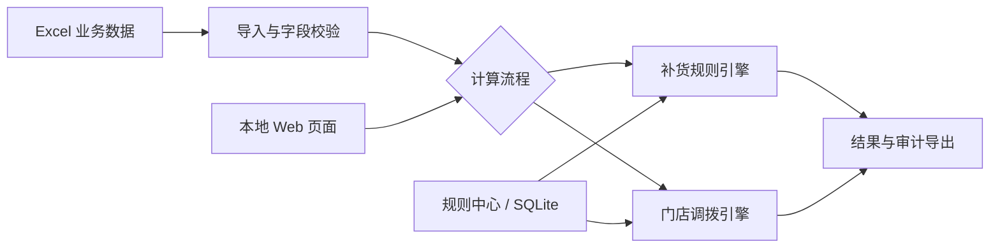

# iRestock | 智能补货与门店调拨系统

一个面向零售库存运营的本地化 Web 应用项目案例。系统将商品、门店和库存数据导入后，按可维护的业务规则计算补货与门店调拨建议，并输出便于复核的 Excel 结果和审计信息。

> 本仓库是经过脱敏的公开项目案例，介绍系统能力和工程实践。客户业务数据、完整规则配置、生产数据库和正式交付源码不在此仓库中。

## 项目背景

零售门店的补货和调拨通常需要同时考虑库存、在途、在单、销量、门店适配与商品规划。人工用表格处理这些条件，容易出现口径不一致、结果难追溯和重复操作。本项目将业务规则、数据处理、结果导出和运行记录整合到一个本地系统中。

## 主要功能

- **智能补货**：读取 Excel 数据源，执行过滤、商品与门店匹配、数量计算和分配，输出补货结果及逐条审计信息。
- **门店调拨**：根据调出与调入条件计算可调拨量，导出包含计算字段的结果表。
- **规则管理**：通过页面维护业务参数与适配条件，并支持规则导入、导出与版本记录。
- **本地运行**：Windows EXE 启动本机 Web 服务，自动选择可用端口；系统托盘提供打开和退出入口，重复启动时复用已运行的实例。
- **结果追溯**：保留本机运行记录，支持查看和下载结果文件。

## 技术实现

| 层次 | 主要技术与职责 |
| --- | --- |
| 页面与接口 | FastAPI、Jinja2、JavaScript；提供业务页面和 API |
| 业务计算 | Python 规则引擎；执行补货与调拨计算 |
| 表格处理 | pandas、openpyxl；导入、校验和导出 Excel |
| 本地存储 | SQLite；保存规则、基础资料和运行记录 |
| Windows 桌面化 | PyInstaller、pystray；打包 EXE 并提供托盘控制 |

## 工程重点

1. **统一计算口径**：让页面配置、Excel 字段和实际执行逻辑使用一致的规则定义。
2. **可解释结果**：除了建议数量，还输出命中条件和中间计算字段，方便业务人员核对。
3. **平稳升级**：把用户运行数据放在应用数据目录，减少 EXE 更新对既有规则和历史结果的影响。
4. **桌面使用体验**：处理动态端口、重复启动、托盘退出和 Windows 打包后的资源路径。

## 项目状态

- 案例所述产品版本：V2.2.4。
- V2.2.4 源码交付验收时，204 项当前产品测试通过，并完成 Windows 冻结版启动与重复实例检查。
- 本仓库为案例介绍，不能直接运行产品。文档中的验证结果对应正式交付版本。

## 工程实践

详见 [工程实践](docs/engineering.md)，包括规则执行的一致性、结果审计设计、本地数据升级和 Windows EXE 交付验证。

## 公开范围

本仓库只包含脱敏案例文档，未发布生产源码、客户专用规则、实际业务数据、账号口令、安装包或客户界面截图。
