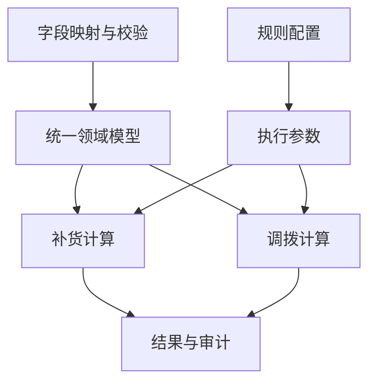

# 工程实践

本页概述 iRestock 的工程经验，省略客户具体业务条件、门店资料和规则参数。

## 1. 规则与数据字段保持一致

业务表格中名称接近的字段，可能代表不同含义。设计时需要把商品属性、门店属性和准入标记分别建模，并明确每个计算流程读取哪些字段。

规则中心的配置必须进入实际计算链路。导入预计算、常规规则执行和不同业务引擎之间，如果重复实现同一条逻辑，就需要对照测试，防止出现页面配置与执行结果不一致。

## 2. 结果需要能够解释

建议数量只是结果的一部分。业务复核还需要知道为什么放行或阻断、使用了哪些规则，以及预留量、可用量等计算字段对应什么范围。

审计字段应明确区分商品层面的汇总数值与商品在某家门店的判断，避免把未进入计算的行显示为真实的零值。导出字段也应随计算模型一起维护，以免页面能算出结果，Excel 却缺少关键解释字段。

## 3. 本地 Web 应用的桌面体验

Windows 用户期望双击启动、清楚知道程序是否运行，并能方便退出。本项目使用桌面启动器管理本机 Web 服务：

- 从可用端口中选择监听地址，并在服务就绪后打开浏览器。
- 使用单实例保护，重复启动时打开已运行的地址。
- 提供系统托盘菜单，支持重新打开系统和退出服务。
- 为打包后的资源路径、日志输出和无控制台运行处理专门的启动逻辑。

## 4. 程序更新与用户数据分开

应用程序文件与用户运行数据库分别存放。更新 EXE 时，应保留用户维护的规则、运行历史和结果文件，并按数据库结构变化执行必要迁移。

首次安装使用的种子数据、历史版本兼容和用户主动重置，是三个不同的场景。交付脚本与文档应明确这些操作的作用，避免程序更新变成意外的数据初始化。

## 5. 验证源码，也验证交付物

源码测试通过后，还需要实际启动冻结版 EXE。打包环境中的依赖、资源路径、标准输出和子进程行为，都可能与开发环境不同。

V2.2.4 源码交付验收包含产品测试、种子数据库完整性检查、PyInstaller 重建、冻结版启动与重复实例检查。交付 ZIP 还进行了文件级哈希比对，确认压缩包内容与交付目录一致。

这些验证结果描述正式产品的验收过程。公开仓库另有可执行的通用工程案例与自己的测试，范围见 [公开工程说明](public-demo.md)。公开代码没有附带生产数据。
